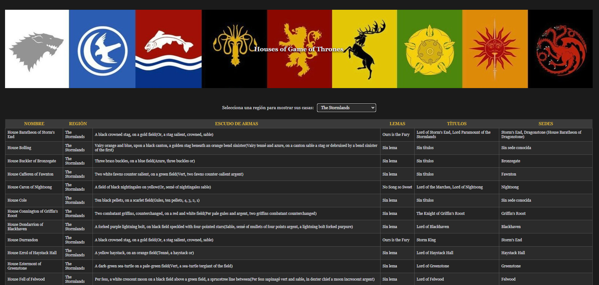

# API Game of Thrones 🐺

Aplicación web que muestra las casas de **Game of Thrones** filtradas por región, utilizando la [API de Ice and Fire](https://anapioficeandfire.com/).

## 🔹 Funcionalidades
- Selección de región a través de un menú desplegable.
- Muestra información de las casas:
  - Nombre
  - Región
  - Escudo de armas
  - Lemas
  - Títulos
  - Sedes
- Manejo de errores en caso de fallo en la API.
- Diseño responsivo y visualmente atractivo inspirado en la serie.

## 🔹 Tecnologías utilizadas
- HTML5
- CSS3
- JavaScript (Vanilla JS con XMLHttpRequest)
- API pública: [An API of Ice and Fire](https://anapioficeandfire.com/)

## 🔹 Captura

## 🔹 Demo
Puedes ver la demo en vivo usando GitHub Pages:  
[Demo en GitHub Pages](https://sandragonzalezdiaz1.github.io/got-houses-api)
