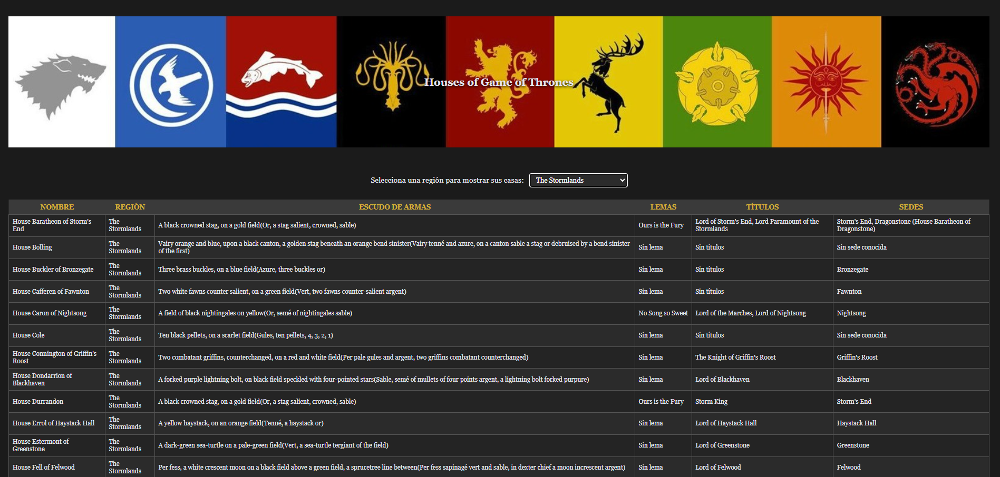

# API Game of Thrones 🐺


Web application that consumes the **An API of Ice and Fire** to display **Game of Thrones houses filtered by region**.  
The data is retrieved dynamically using **XMLHttpRequest** and rendered on the page.

---

## 🌐 Live Demo

👉 https://sandragonzalezdiaz1.github.io/got-houses-api

---

## 📌 About the Project

This project allows users to explore the noble houses from **Game of Thrones** by selecting a region from a dropdown menu.

The application retrieves house data from the **Ice and Fire API** and dynamically displays relevant information about each house.

Displayed information includes:

- House name
- Region
- Coat of arms
- Words (motto)
- Titles
- Seats

The interface is inspired by the visual style of the series and designed to be **responsive and user-friendly**.

---

## ✨ Features

- Region selection using a dropdown menu
- Dynamic API requests using **XMLHttpRequest**
- Display of multiple house details
- Error handling in case the API request fails
- Responsive layout
- Dynamic content rendering without page reload

---

## 📸 Screenshot



---

## 🛠️ Technologies 

- HTML5
- CSS3
- JavaScript (Vanilla JS)
- XMLHttpRequest
- Public API: **An API of Ice and Fire**

API documentation:  
https://anapioficeandfire.com/

---

## 📁 Project Structure

```text
got-houses-api
│
├── index.html
├── css
│   └── styles.css
├── js
│   └── app.js
├── assets
│   └── houses.jpg
|   └── screenshot.png
└── README.md
```

---

## 🚀 How to Run the Project

1. Clone the repository

```bash
git clone https://github.com/sandragonzalezdiaz1/got-houses-api.git
```

2. Navigate to the project folder.

3. Open the file:

```text
index.html
```

No installation or dependencies are required.

---

## 📚 What I Learned

Through this project I practiced:

- Consuming external **REST APIs**
- Making asynchronous requests with **XMLHttpRequest**
- Parsing and displaying API data
- Handling API errors
- Dynamically updating the **DOM**
- Creating responsive layouts

---

## 🚧 Future Improvements

- Add pagination for houses
- Include search functionality
- Display additional house details (sworn members, founder, etc.)
- Replace **XMLHttpRequest** with the modern **Fetch API**
- Improve UI animations and interactions

---

## 👩‍💻 Author

**Sandra González**

Junior Web Developer  

GitHub:  
https://github.com/sandragonzalezdiaz1